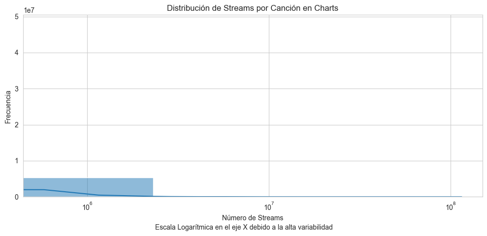
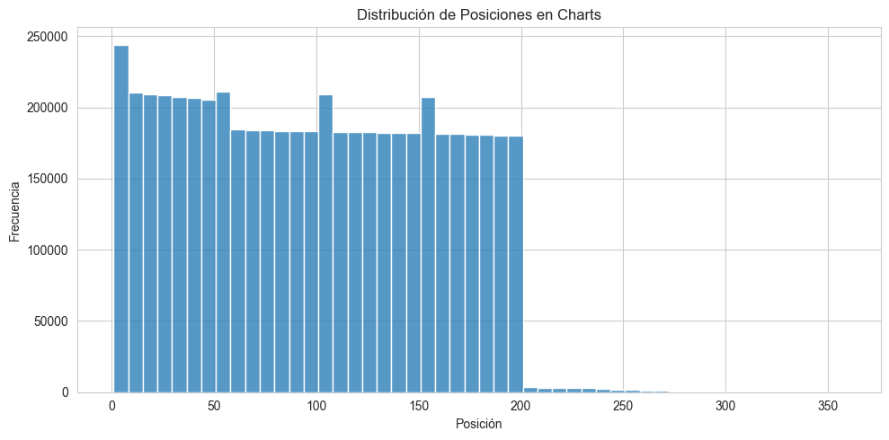
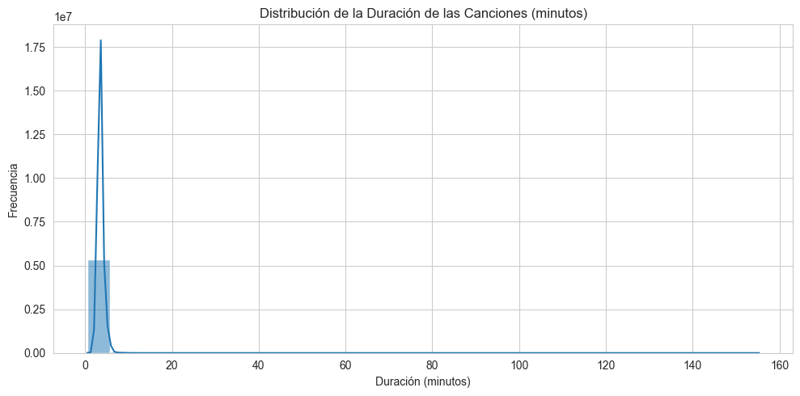
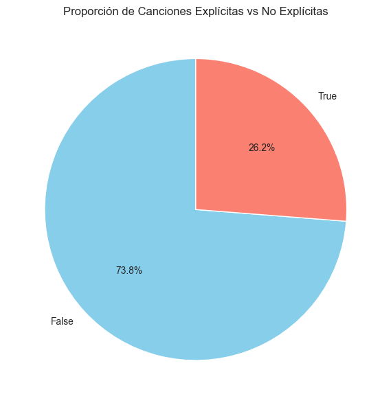
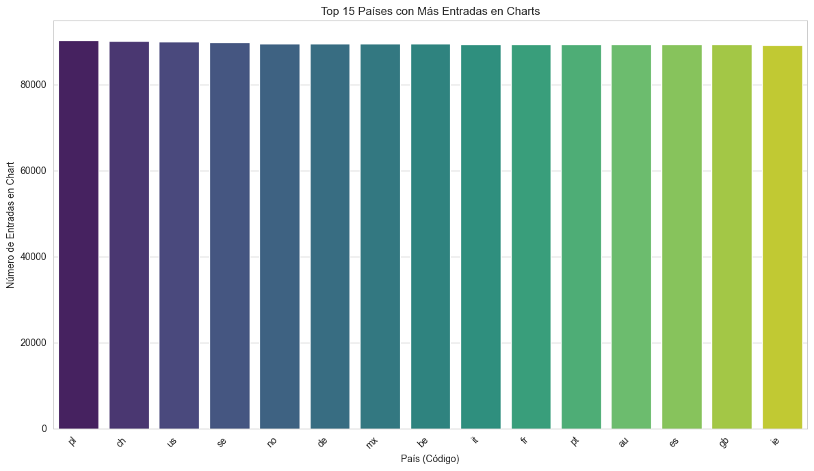
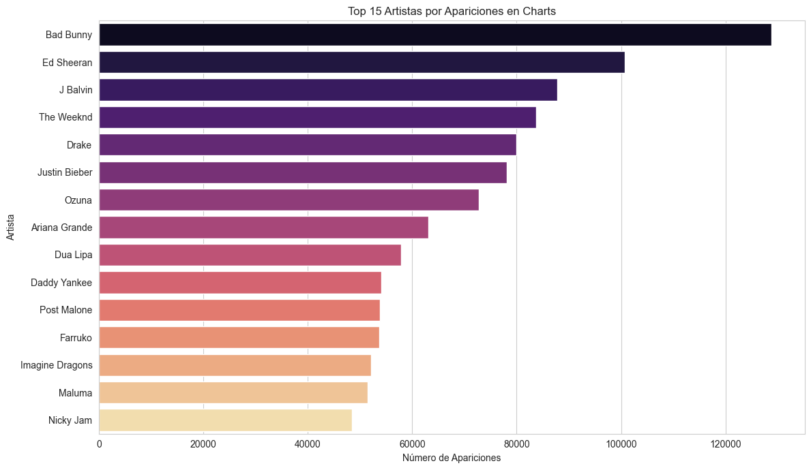
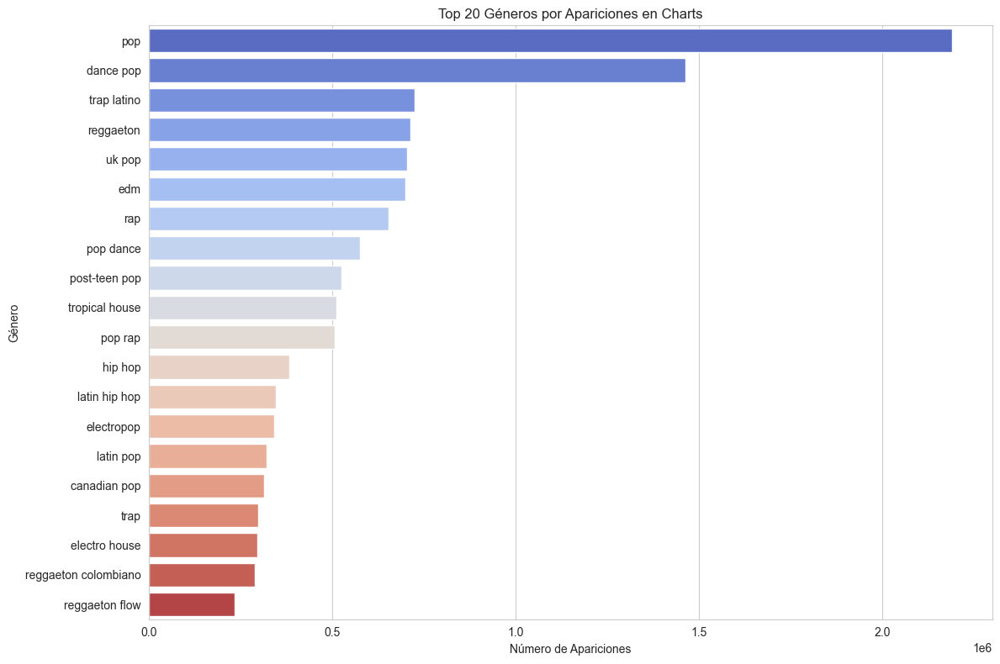
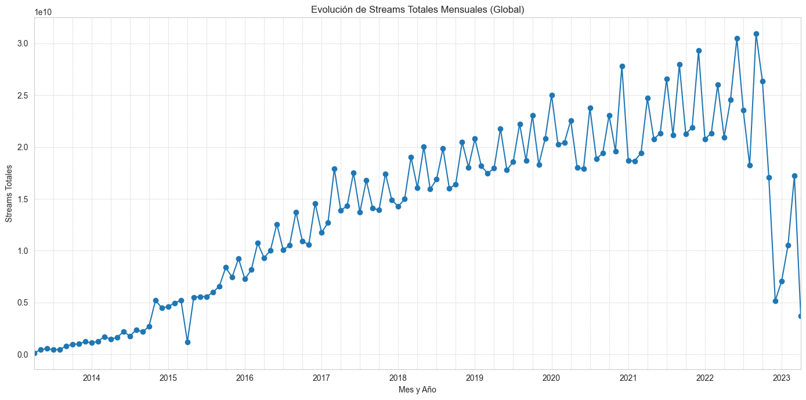
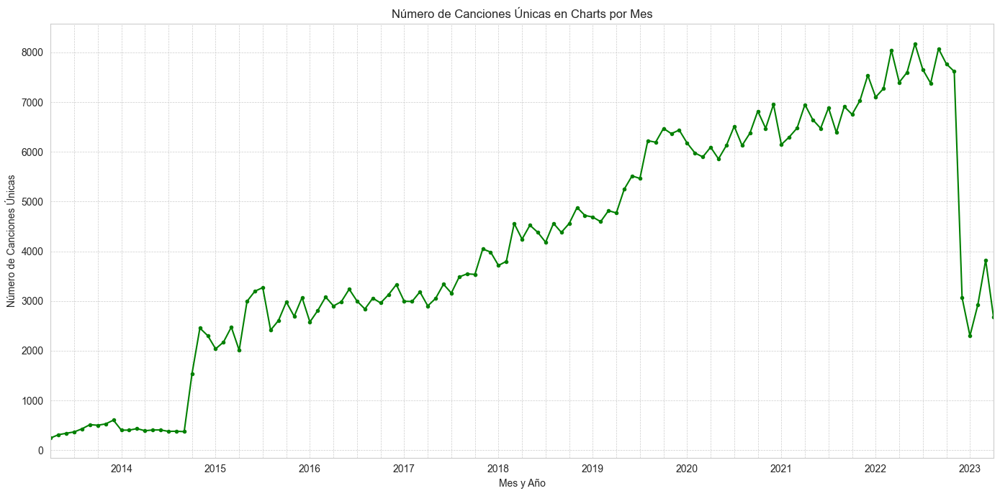
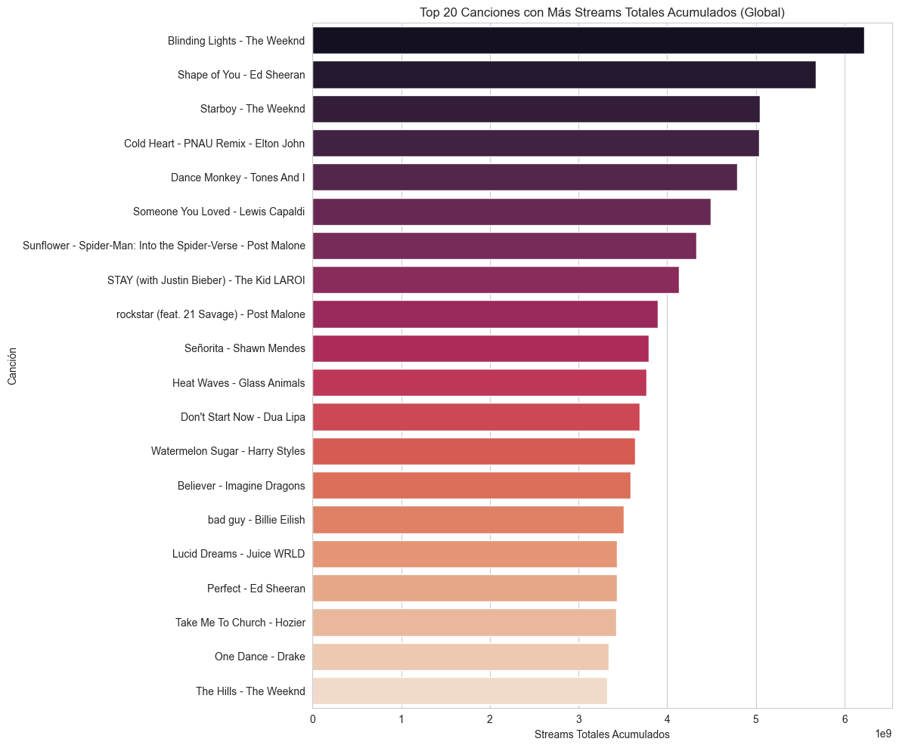

<h1>Music_Wars</h1>

<h2>Por: Saul Escola García - Asignatura: Visualización de Datos</h2>

<h2>1. Introducción: Preguntas y Objetivos</h2>

    La música es una fuerza omnipresente y en constante evolución, y las plataformas de streaming como Spotify se han convertido en el principal barómetro de las tendencias musicales globales. Este proyecto se sumerge en el vasto océano de datos de los charts de Spotify para visualizar y comprender la dinámica de la popularidad de las canciones a lo largo de casi una década.

    Partiendo del dataset "Spotify Chart Data" (que abarca desde 2013 hasta finales de 2023), que incluye información sobre millones de entradas en los charts de diversos países, surgieron las siguientes preguntas clave:

<ul>
    <li>¿Cómo ha evolucionado el ranking de las canciones más escuchadas a nivel global mes a mes?</li>
    <li>¿Qué canciones han logrado un impacto duradero, manteniéndose en la cima de la popularidad durante períodos extensos?</li>
    <li>¿Existen "fenómenos musicales" o "one-hit wonders" claramente identificables por su rápido ascenso y descenso en los charts?</li>
    <li>¿Se pueden observar patrones o cambios en la velocidad con la que nuevas canciones alcanzan el estrellato y otras son desplazadas?</li>
</ul>

    Los <strong>objetivos principales</strong> de este proyecto de visualización son:

<ol>
    <li><strong>Presentar de forma dinámica y atractiva</strong> la evolución de la popularidad de las canciones (Top 1000 global) utilizando streams acumulativos mensuales como métrica principal.</li>
    <li><strong>Facilitar la identificación de tendencias</strong>, canciones dominantes y la naturaleza cambiante de los gustos musicales a lo largo del tiempo.</li>
    <li><strong>Demostrar la aplicación de técnicas de preprocesamiento de datos y visualización de información</strong> para extraer insights de un conjunto de datos complejo y de gran volumen.</li>
</ol>

    A través de un "Bar Chart Race", se busca ofrecer una narrativa visual que no solo muestre datos, sino que también cuente la historia de la música que ha marcado la última década en Spotify.

<h2>2. El Dataset: Origen, Procesamiento y Análisis Exploratorio</h2>
                    

                        El conjunto de datos fundamental para este proyecto es el <a href="https://www.kaggle.com/datasets/jfreyberg/spotify-chart-data" target="_blank">"Spotify Chart Data"</a>, publicado por Jan Freyberg en Kaggle. Este dataset público recopila información de los charts diarios de Spotify a nivel global y para múltiples países. Para este análisis, se ha utilizado una versión que abarca desde principios de 2013 hasta finales de 2022/principios de 2023 (según la última fecha completa disponible en los datos).
                    

                    

                        Para preparar los datos para la visualización del "Bar Chart Race", se realizaron varios pasos de preprocesamiento y transformación utilizando Python y Pandas, almacenados en el archivo <code>df_final_preprocesado.csv</code>, que luego se procesó para generar <code>spotify_data_for_livingcharts_millions_date_1stream_start.csv</code> para la herramienta de visualización online. Los pasos clave incluyeron:
                    

                    <ul>
                        <li><strong>Limpieza de Datos:</strong> Se manejaron valores nulos (especialmente en nombres de canciones) y se aseguró la correcta interpretación de las fechas.</li>
                        <li><strong>Creación de Identificadores de Canción:</strong> Se generó un nombre de visualización único y limpio para cada canción, combinando el título y el artista principal.</li>
                        <li><strong>Agregación Global y Mensual:</strong> Los streams diarios de cada canción en todos los países del dataset original (<code>charts.csv</code>) fueron sumados para obtener un total global diario. Posteriormente, estos totales diarios se agregaron para obtener los streams totales globales por mes para cada canción.</li>
                        <li><strong>Ajuste Inicial de Streams:</strong> Para una mejor visualización en el "race", a las canciones que tenían 0 streams en el primer período se les asignó un valor nominal de 1 stream.</li>
                        <li><strong>Cálculo de Streams Acumulativos:</strong> Se calcularon los streams acumulativos mensuales para cada canción.</li>
                        <li><strong>Conversión a Millones:</strong> Los valores de streams acumulativos se dividieron por un millón para facilitar su lectura en los ejes del gráfico.</li>
                        <li><strong>Optimización:</strong> Se seleccionaron las 200 canciones con mayor número de streams acumulados al final del período para enfocar la visualización.</li>
                    </ul>

<h3>Análisis Exploratorio de Datos (EDA)</h3>
                    

                        El Análisis Exploratorio de Datos (EDA) fue fundamental para comprender la estructura, distribución y tendencias inherentes al dataset, y para guiar las decisiones de la visualización final. A continuación, se presentan los hallazgos más relevantes:
                    

                        
                        
<em>Figura 1: Distribución de streams por entrada en chart. La escala logarítmica en el eje X evidencia la alta concentración de canciones con streams moderados y la larga cola de "mega-hits" con reproducciones masivas.</em>

                        
                        
<em>Figura 2: Distribución de las posiciones ocupadas en los charts. La mayoría de las entradas se concentran en las posiciones del Top 200, como es de esperar.</em>

    
    
<em>Figura 3: Distribución de la duración de las canciones (en minutos). Se observa un pico claro alrededor de los 3-4 minutos, típico de las canciones populares.</em>

    
    
<em>Figura 4: Proporción de canciones marcadas como "explícitas" frente a las no explícitas en el dataset.</em>

    
    
<em>Figura 5: Top 15 países con mayor número de entradas en los charts, indicando una alta actividad de reporte o escucha en estas regiones.</em>

    
    
<em>Figura 6: Top 15 artistas con más apariciones en los charts globales, destacando a los más consistentemente populares.</em>

    
    
<em>Figura 7: Top 20 géneros (según la API de Spotify) por apariciones. La granularidad de los géneros resalta la necesidad de una normalización para análisis de "familias de géneros".</em>

    
    
<em>Figura 8: Evolución de los streams totales globales agregados mensualmente. Se observa una tendencia general al alza en la actividad de streaming a lo largo de los años. La caída al final corresponde a la completitud de los datos del último año.</em>

    
    
<em>Figura 9: Número de canciones únicas que aparecen en los charts cada mes. Esta métrica también muestra un crecimiento, sugiriendo una mayor rotación o diversidad musical con el tiempo.</em>

    
    
<em>Figura 10: Top 20 canciones por streams totales acumulados a lo largo de todo el período. Este gráfico justifica el uso de streams acumulativos para el bar chart race, ya que resalta la popularidad sostenida.</em>

    Estos análisis exploratorios fueron cruciales para definir la métrica de streams acumulativos como la más idónea para el Bar Chart Race, permitiendo visualizar de forma clara la persistencia y el impacto a largo plazo de las canciones en el competitivo mundo del streaming musical.

## 3. Análisis Visual y Elección de Codificaciones
La visualización principal es un **Bar Chart Race**:

<!-- Para incrustar un video, GitHub no lo hace directamente en el README.
     Puedes subir el video al repositorio y poner un enlace de descarga,
     o subirlo a YouTube/Vimeo y poner el enlace.
     Para una imagen (si haces un GIF del race):
     
     Si es un MP4, la mejor opción es poner un thumbnail y enlazar al video:
-->

*Haz clic en la imagen para ver el video del Bar Chart Race (asegúrate de que `nombre_de_tu_video.mp4` esté en el repositorio).*

**Justificación de las codificaciones visuales:**
- **Longitud de Barra:** ...
- ...

### Análisis Exploratorio de Datos (EDA)

*Descripción del gráfico EDA 1...*

*Descripción del gráfico EDA 2...*

## 4. Elementos Interactivos
La visualización (el video) ofrece interactividad a través de los controles del reproductor...

## 5. Composición y Diseño Visual
Se ha buscado una composición limpia...

## Material Complementario
- [Repositorio de GitHub con Código y Datos](https://github.com/TU_USUARIO_GITHUB/NOMBRE_DEL_REPOSITORIO)
- [Dataset CSV Final Utilizado](spotify_data_for_livingcharts_millions_date_1stream_start_TOP200.csv)
